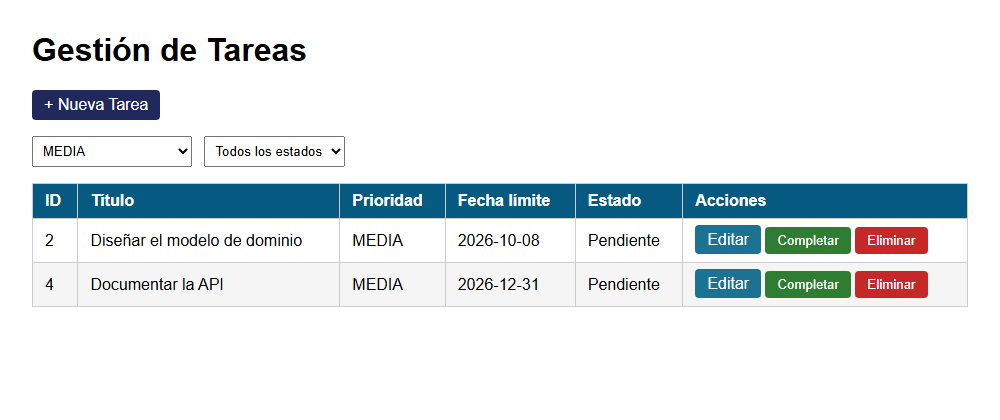
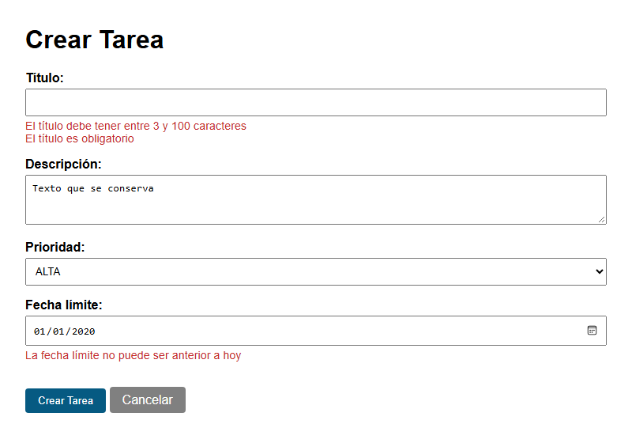
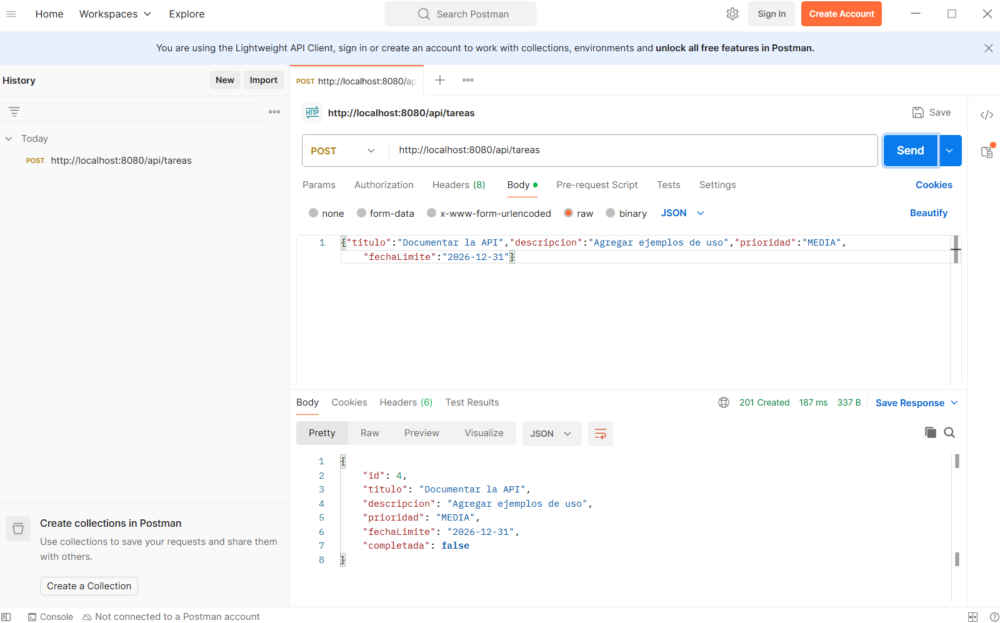
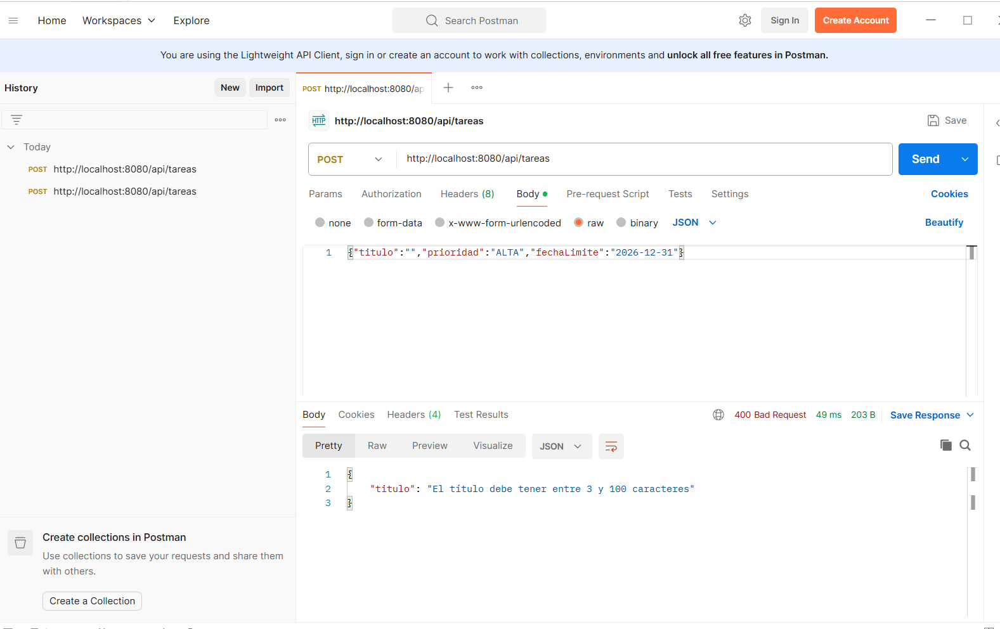

# Post-contenido Unidad 7: gestión de tareas con Spring Boot

## Descripción
Repositorio del laboratorio de la Unidad 7 de Programación Web (séptimo semestre). Contiene un único proyecto Spring Boot (`gestion-tareas`, paquete `com.universidad.tareas`) con dos capas sobre el mismo `TareaService`: una vista Thymeleaf con `@Controller` (Parte 1) y una API REST con `@RestController` (Parte 2). Los datos viven en memoria, así que la vista web y la API leen y escriben sobre la misma lista.

## Estructura del proyecto
```
src/main/java/com/universidad/tareas/
├── TareasApplication.java
├── model/        Tarea.java, Prioridad.java
├── service/      TareaService.java
└── controller/   TareaController.java, TareaApiController.java, ApiErrorHandler.java
src/main/resources/
├── application.properties
└── templates/tareas/   lista.html, formulario.html
capturas/
```

## Parte 1: vista Thymeleaf con @Controller
`TareaController` expone `/tareas` con filtrado por `@RequestParam` (`prioridad` y `completada`), formularios validados con `@Valid` y `BindingResult`, y las acciones completar y eliminar como POST. Todas las operaciones que modifican datos terminan en un redirect (Post/Redirect/Get). Las reglas de Bean Validation están en el modelo `Tarea`.

## Parte 2: API REST con @RestController
`TareaApiController` expone `/api/tareas` con los verbos GET, POST, PUT, PATCH y DELETE. Recibe por constructor la misma instancia de `TareaService` que usa la Parte 1. `ApiErrorHandler` convierte los errores de `@Valid` en un JSON con un mensaje por campo y código 400, en lugar de la página de error HTML de Spring Boot.

## Endpoints de la API
| Método | URL | Éxito | Error | Descripción |
|---|---|---|---|---|
| GET | `/api/tareas` | 200 OK | | Lista las tareas en JSON. Admite `?prioridad=` y `?completada=`. |
| GET | `/api/tareas/{id}` | 200 OK | 404 Not Found | Devuelve la tarea con ese id. |
| POST | `/api/tareas` | 201 Created | 400 Bad Request | Crea una tarea con el JSON del cuerpo. Falla con 400 si no cumple la validación. |
| PUT | `/api/tareas/{id}` | 200 OK | 404 / 400 | Reemplaza todos los campos de la tarea. |
| PATCH | `/api/tareas/{id}/completar` | 200 OK | 404 Not Found | Marca solo `completada` como verdadera. |
| DELETE | `/api/tareas/{id}` | 204 No Content | 404 Not Found | Elimina la tarea. |

Ejemplo de creación:

```
curl -X POST http://localhost:8080/api/tareas -H "Content-Type: application/json" -d '{"titulo":"Documentar la API","descripcion":"Agregar ejemplos de uso","prioridad":"MEDIA","fechaLimite":"2026-12-31"}'
```

## Decisiones de diseño
- Inyección por constructor en ambos controladores, sin `@Autowired` en el campo. Deja explícita la dependencia y permite instanciar la clase a mano en una prueba unitaria con un `TareaService` de prueba.
- `@FutureOrPresent` en `fechaLimite` en lugar de `@Future`: una tarea que vence el mismo día en que se crea es válida, y `@Future` la rechazaría.
- POST para completar y eliminar en `TareaController`. Una petición GET debe ser segura y no cambiar el estado del servidor; con un enlace GET, un rastreador o el precargador del navegador podría borrar tareas sin que nadie lo pida.
- PATCH para `/api/tareas/{id}/completar`, porque cambia un solo campo. PUT reemplaza el recurso completo y obligaría al cliente a reenviar título, descripción, prioridad y fecha solo para marcar una tarea como hecha.
- La validación se maneja distinto en cada capa. La vista usa `BindingResult` para volver a mostrar el formulario con un mensaje junto a cada campo, y la API usa `@RestControllerAdvice` para devolver JSON. Cada una responde en el formato que le corresponde.
- Persistencia en memoria (un `Map` en `TareaService`) en lugar de JPA e Hibernate, que se estudian en la Unidad 8.
- `spring.mvc.format.date=iso` en `application.properties`. Sin esa línea, Spring escribe las fechas en el formato local (por ejemplo `6/10/26`) y el campo `<input type="date">` solo acepta `2026-10-06`, así que la fecha salía vacía al editar una tarea o al volver al formulario tras un error de validación.

## Cómo compilar y ejecutar
Requisitos: JDK 17, Maven 3.8 o superior y Git. Para probar la API, Postman o curl.

1. Clonar el repositorio: `git clone https://github.com/julianejurado-rgb/jurado-post1-u7.git`
2. Abrir la carpeta como proyecto Maven en el IDE.
3. Ejecutar `mvn spring-boot:run`. La consola debe mostrar "Started TareasApplication".
4. Vista web: `http://localhost:8080/tareas`
5. API REST: `http://localhost:8080/api/tareas`

## Capturas de pantalla
Lista de tareas filtrada por prioridad MEDIA. La tarea 4 se creó antes con la API, y aparece también en la vista web porque ambas capas comparten el mismo servicio:



Formulario con errores de validación. Los datos ya ingresados se conservan:



Creación de una tarea desde la API (POST, 201 Created):



Intento de crear una tarea con el título vacío (POST, 400 Bad Request):


